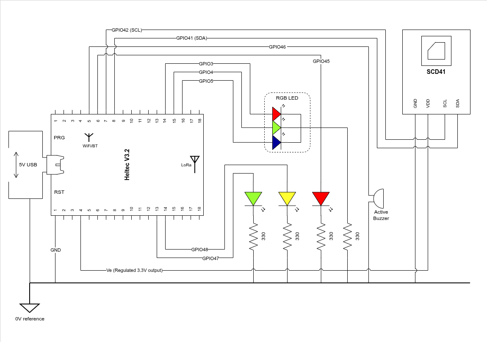

# IAMSPI
Iot Air Monitoring System for Productivity Improvement, Internet of Things project for IoT Algorithms and Services course (2025/2026) at Sapienza University.

## Group Members
[Dakshita Minocha](https://www.linkedin.com/in/dakshita-minocha-5b11ab1ba/)

[Damiano Ferioli](https://www.linkedin.com/in/damiano-ferioli-5366783b8/)

[Ebrahim Afridi](https://www.linkedin.com/in/ebrahimafridi)

# First delivery
The presentation of the project can be found in Booklets/Presentation_IoTeam2026_definitive.pdf.

# Second Delivery

The wiring diagram of the current prototype.

A simple demonstration of the core functionality is available on Youtube.
[Link to the YT video](https://youtu.be/BHO6ZXLrhL8)
